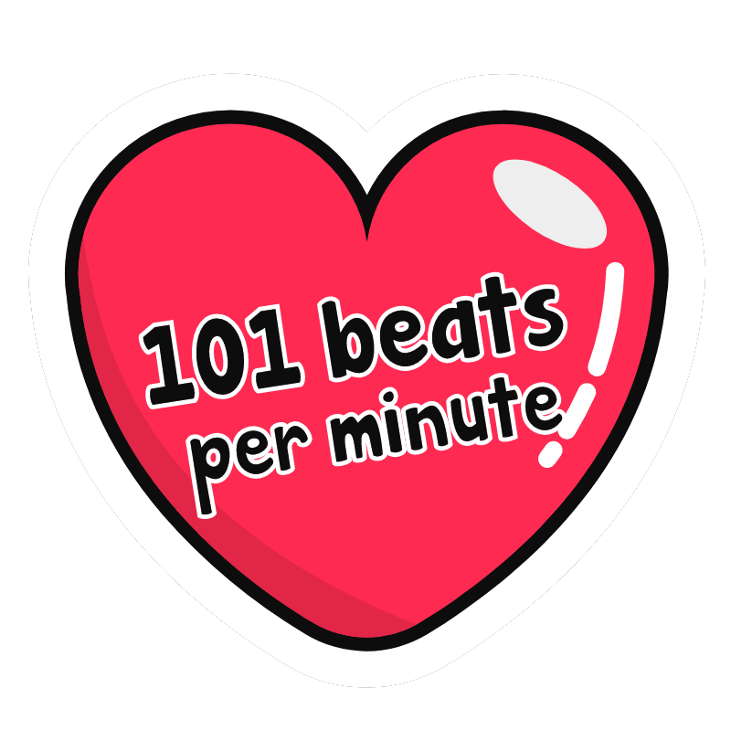
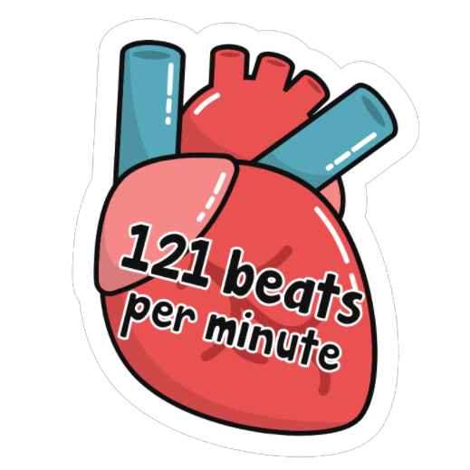
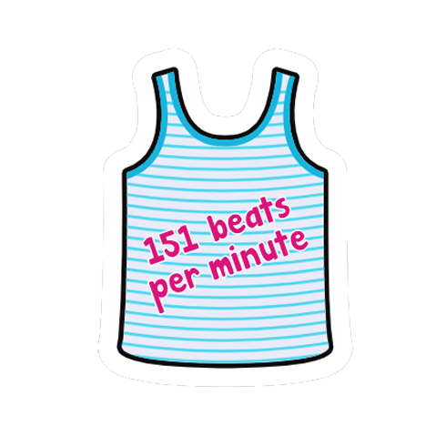
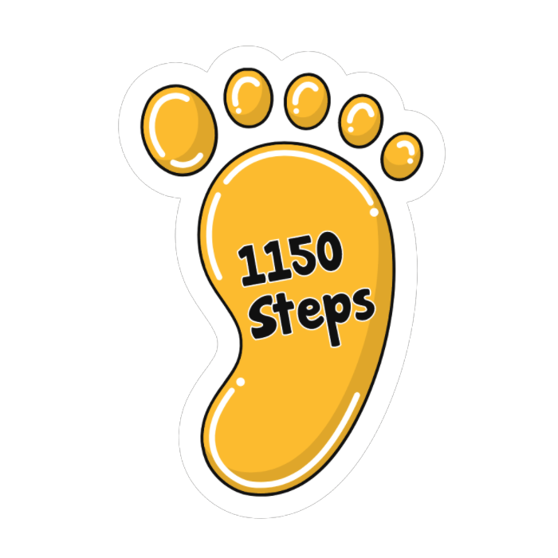
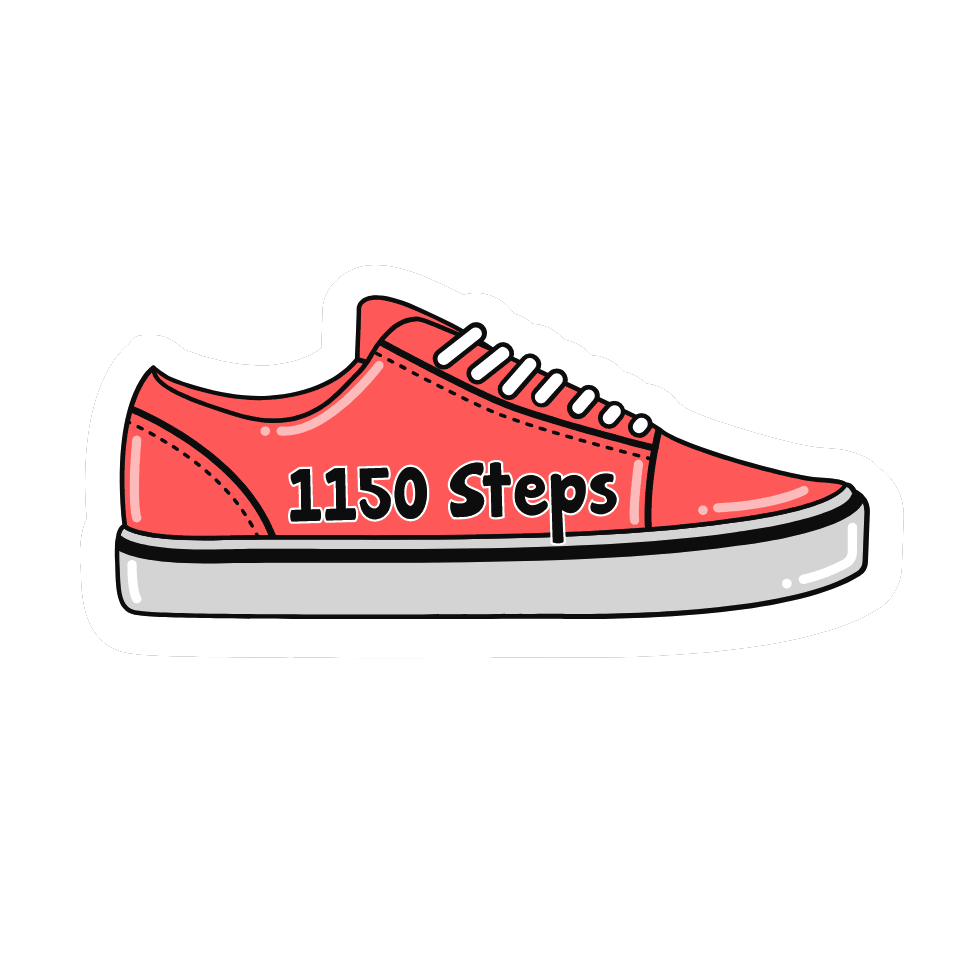

# Sticker-Server
Server-side sticker recorder.

## Set-Up
### Install Project Dependencies
- Before git clone this repository, please make sure all dependencies for **puppeteer** are already installed in your instance.
  - For more details please review the list on the top of the page, https://github.com/GoogleChrome/puppeteer/blob/master/docs/troubleshooting.md
- After cloning this repository into your instance, please navigate into root folder of the server, **/sticker-server**, then run the command.
  - **npm install**
### Install forever
- Install **forever** if you want to keep running the server after exiting the instance
  - **sudo npm install forever -g**

## Usage
### Run Temporarily
- Please navigate to root folder of the server, **/sticker-server**, then run the command.
  - **npm start**  
### Run Forever
- Run the Server Forever, Please Run the Command.
  - **forever start --minUptime 1000 --spinSleepTime 1000 ./bin/www**
### Stop Forever 
- Stop the Server from Running Forever, Please Run the Command.
  - **forever stop ./bin/www**

# Stickers Wiki
<b>API Endpoint:</b> http://sheltered-waters-08469.herokuapp.com/{sticker}/?value={number}&type={str}&option={str}&goal={number}
## Heartbeat
| | |
|---|---|
| </img> | [<b>Sample</b>](http://sheltered-waters-08469.herokuapp.com/heartbeat/?value=121&type=plain-domain-relevant-1&option=shake) | 
| type | plain-domain-relevant-1 |
| value | <i>required</i> |
| option | [count, shake, pulse] |

| | |
|---|---|
| </img> | [<b>Sample</b>](http://sheltered-waters-08469.herokuapp.com/heartbeat/?value=100&type=plain-domain-relevant-2&option=count) | 
| type | plain-domain-relevant-2 |
| value | <i>required</i> |
| option | [count, shake, pulse] |

| | |
|---|---|
| </img> | [<b>Sample</b>](http://sheltered-waters-08469.herokuapp.com/heartbeat/?value=100&type=plain-domain-relevant-3&option=count) | 
| type | plain-domain-relevant-3 |
| value | <i>required</i> |
| option | [count, shake, pulse] |

 

## Steps
| | |
|---|---|
| </img> | [<b>Sample</b>](http://sheltered-waters-08469.herokuapp.com/steps/?value=1150&type=plain-domain-relevant-1&option=shake) | 
| type | plain-domain-relevant-1 |
| value | <i>required</i> |
| option | [count, shake, pulse] |

| | |
|---|---|
| </img> | [<b>Sample</b>](http://sheltered-waters-08469.herokuapp.com/steps/?value=1150&type=plain-domain-relevant-2&option=count) | 
| type | plain-domain-relevant-2 |
| value | <i>required</i> |
| option | [count, shake, pulse] |
